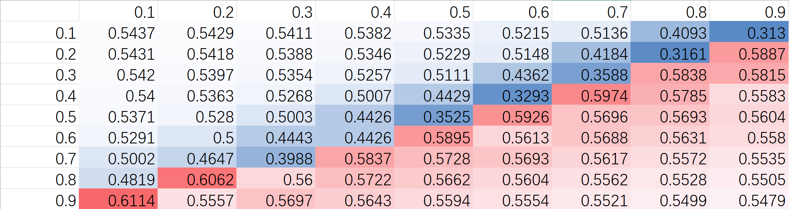
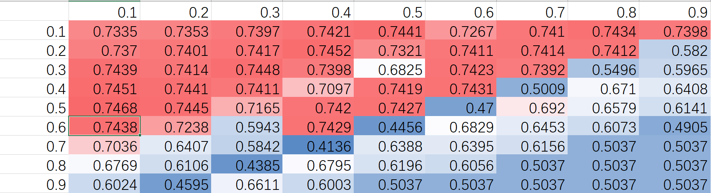
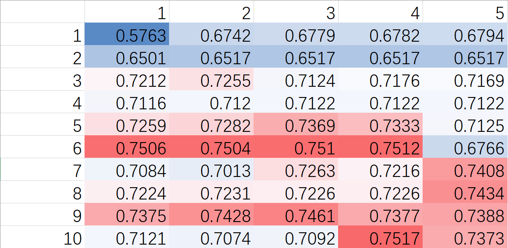
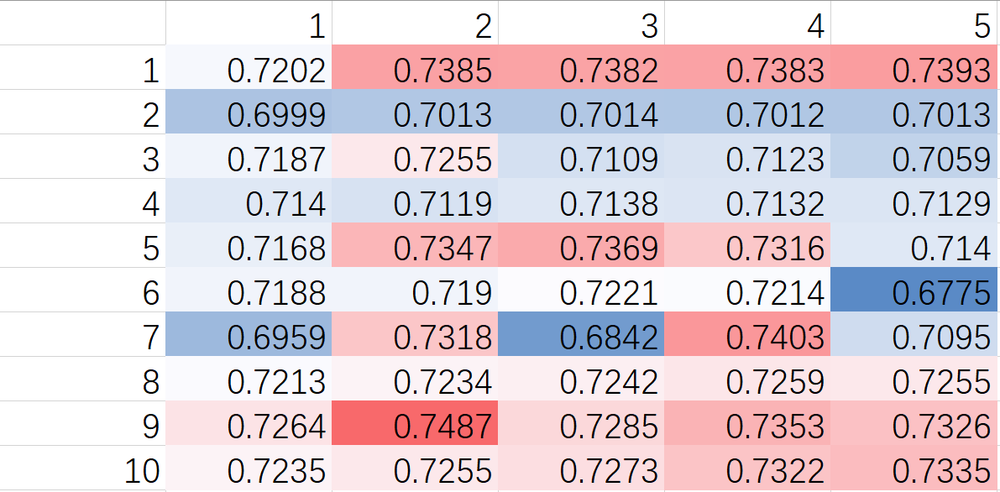
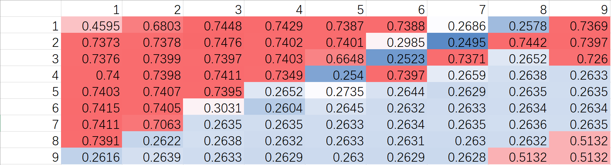

## TODO

linear和kan混合使用adam训练时：

- linear部分下降快，需要的学习率0.003左右，但会过拟合，需要早停
- kan部分需要的学习率0.01左右，和linear混合共同训练时疑似训练不充分，进一步训练效果提升不明显，（后经g&n linear初步观察发现）可能是linear过拟合效果变差，kan部分效果提升不明显。

能想到的解决方法：

- 细调学习率，或者冻结参数（同时还得找最优超参）
- 增加 linear 部分的复杂度，或者加正则项等

## 记录

### g&n linear: 0.94

### g&n kan: 0.6

- 调参alpha gamma:

### g&n efficient kan: 0.75

- 调参alpha gamma：

- 只调g的grid_size spline_order，固定n为默认值5 3：

- 同时调g&n的grid_size spline_order，二者共享超参（由此可知大概需要分别调超参才能更优，但上升空间估计不大）：

### g Linear, n efficient kan: 0.74

### g Linear, n efficient kan: 0.5左右

效果太差了没记录
